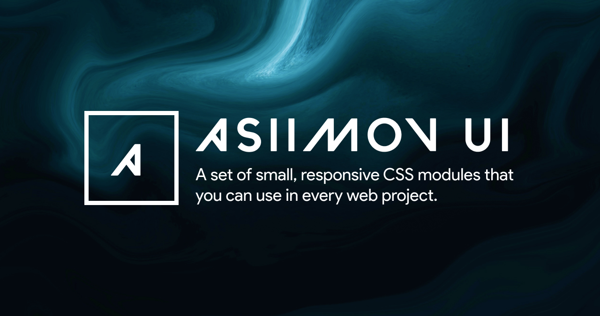

<h1 align="center">
<br>
  
<br>
<br>
Asiimov UI
</h1>

<p align="center">
Asiimov UI is ridiculously tiny CSS Library. The entire set of modules clocks in at 6KB*.
</p>

<p align="center">
<span> 
  <a href="https://opensource.org/licenses/MIT">
    
  </a>

<a href="https://app.netlify.com/sites/asiimov-css/deploys">
    
  </a>

</span>

</p>

<hr />

## Built With

- ⚛️ **React** — A JavaScript library for building user interfaces.
- 3️⃣ **Three** - Lightweight, cross-browser, general purpose 3D library.
- ✨ **React Springs** — A spring-physics based animation library that covers most the UI related animations.
- 3️⃣ **React Three Fiber** — A React renderer for threejs.
- 🔗 **React Router** — Declarative routing for React.

## Getting started

1. Clone this repo using `git clone https://github.com/sushilburagute/asiimov-css.git`
2. Move yourself to the appropriate directory<br />
3. Run `yarn` to install dependencies<br />
4. Run the development server:

```bash
npm run dev
# or
yarn dev
```

Open [http://localhost:3000](http://localhost:3000) with your browser to see the result.

## Still Under Development

- [ ] Modal
- [ ] Mobile Functionality for Landing page

## License

This project is licensed under the MIT License - see the [LICENSE](https://opensource.org/licenses/MIT) page for details.

## Author

Sushil Buragute - [Twitter](https://twitter.com/codetastic1) - [Linkedin](https://www.linkedin.com/in/sushil-buragute/)
